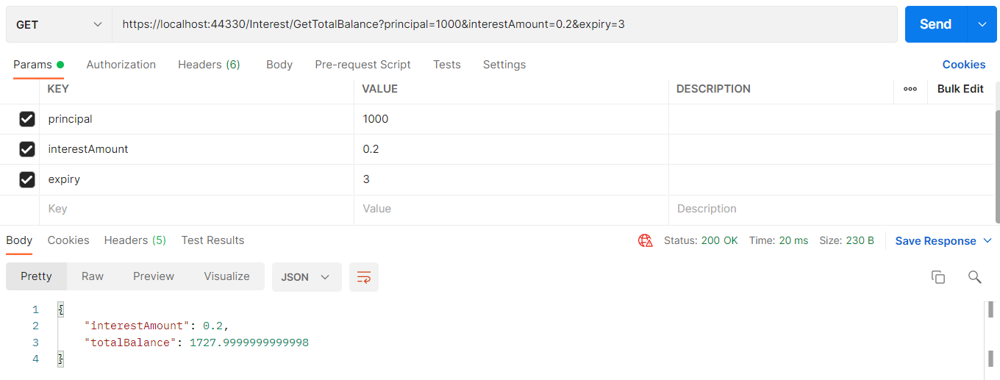
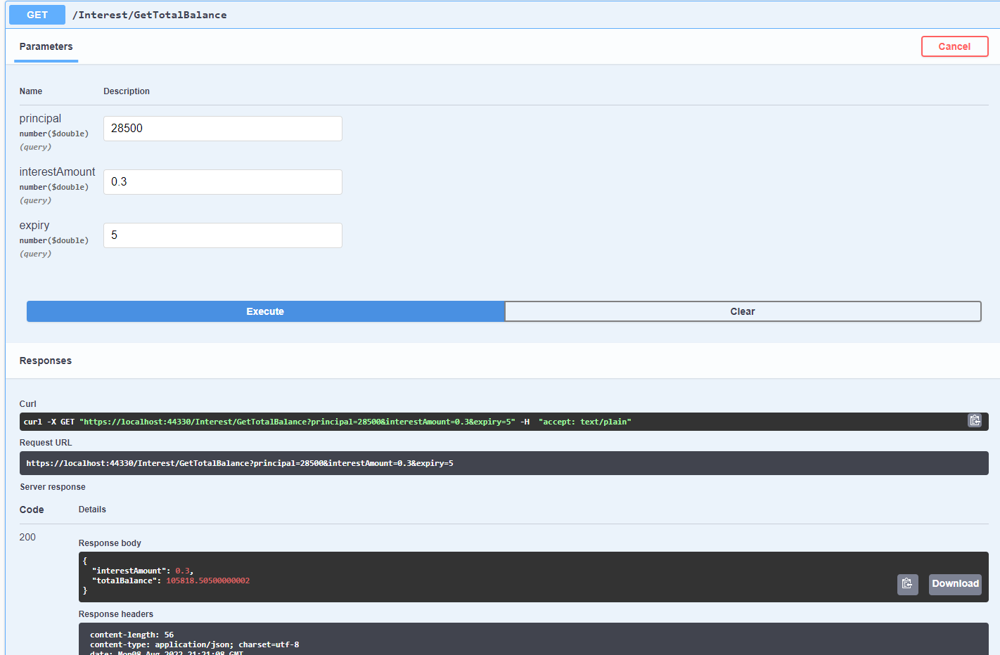

# Bileşik Faiz Hesaplama Api
Bu projede anapara, vade süresi ve faiz yüzdesi parametreleri alınarak bileşik faiz hesabı yapılmıştır.

## Installation
Öncelikle projeyi kolonlayın.

```
git clone (Buraya sizin reponuzdan aldığınız link gelecek)
```

## Usage
Projeyi cloneladıktan sonra Visual Studio 2019 programında açınız.

Daha sonra uygulamayı çalıştırabilirsiniz.


## Outputs




